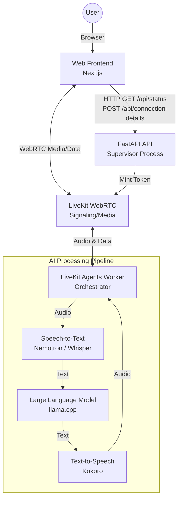
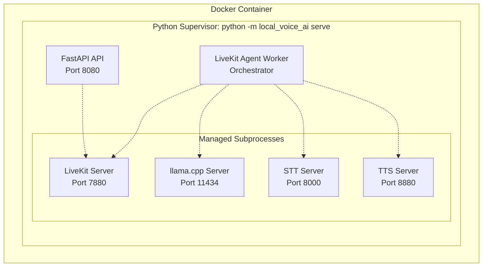
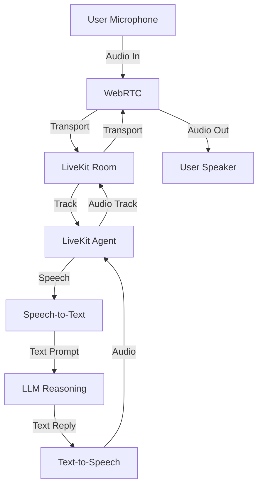
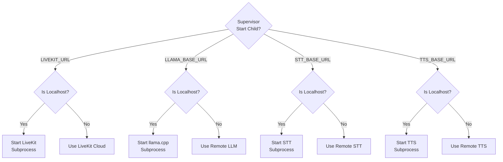
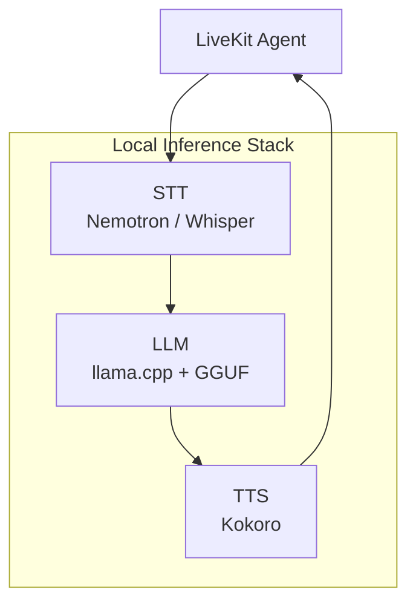
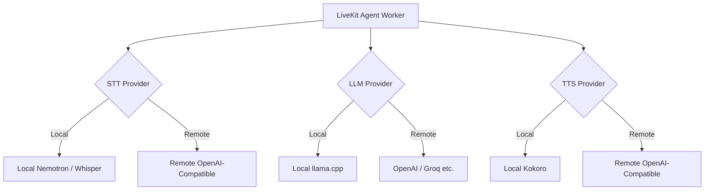
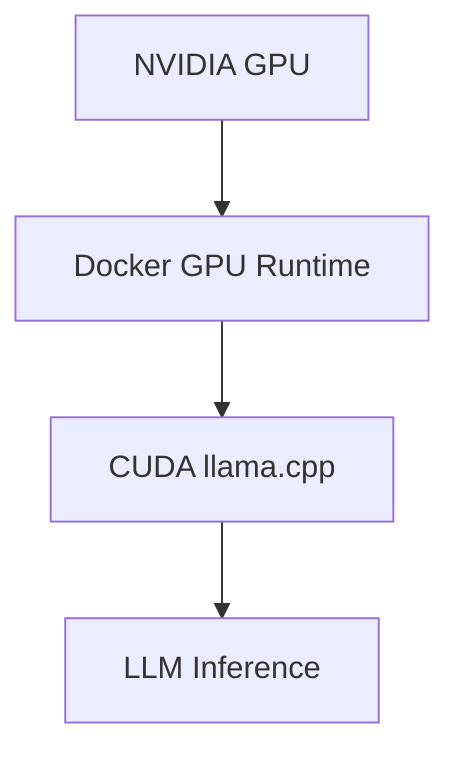

<div align="center">
  
  <h1>Voice Agent</h1>
  <p>A customized real-time voice AI assistant — STT, LLM, TTS — running in <strong>one container</strong>, supervised by a single Python parent process.</p>
  <p>Developed and customized by Abilash Aruva.</p>
</div>

## Overview

Everything runs as managed children of one Python supervisor (`python -m local_voice_ai serve`):

- **LiveKit server** (Go binary subprocess) for WebRTC signaling — skipped if `LIVEKIT_URL` points at LiveKit Cloud.
- **llama.cpp** (`llama-server` binary subprocess) for the LLM — default model is Gemma 4 E2B (quantization-aware-trained 4-bit, ~2.6 GB); swap it with `LLAMA_HF_REPO=org/repo:quant`. Skipped if `LLAMA_BASE_URL` points elsewhere.
- **Nemotron STT** or **Whisper (faster-whisper)** — Python uvicorn child, OpenAI-compatible.
- **Kokoro TTS** — Python uvicorn child, OpenAI-compatible.
- **LiveKit Agents worker** — the orchestrator child.
- **FastAPI** in the supervisor itself, serving `POST /api/connection-details` (token minting) and the statically-exported Next.js frontend.

Children speak HTTP only over `127.0.0.1`. The image exposes four ports: `8080` (web), `7880`, `7881`, `7882/udp` (LiveKit WebRTC, only if running locally).

---

## Architecture

### 1. System Architecture
The application runs as a cohesive system connecting user interfaces, real-time communication, and an AI inference pipeline.



### 2. Single-Container Supervisor
A core strength of this project is its single-container architecture. A central Python process governs all subsystem lifecycles.



### 3. Real-Time Voice Pipeline
The end-to-end voice flow travels from the user's microphone through the reasoning layer and back to their speaker with ultra-low latency.



### 4. Service Management Flow
The supervisor intelligently manages local subprocesses. If a base URL is configured for an external address, the supervisor skips launching the local equivalent.



### 5. Local Inference Stack
When running fully local, the AI runtime utilizes specific models optimized for real-time edge processing.



### 6. Cloud/Remote Provider Switching
The architecture supports hybrid setups seamlessly. You can offload specific tasks to cloud providers.



### 7. GPU Architecture
NVIDIA GPUs map seamlessly into the container for rapid, hardware-accelerated LLM reasoning.



### 8. Application Layers

| Layer      | Component                       | Responsibility                              |
| ---------- | ------------------------------- | ------------------------------------------- |
| UI         | Next.js                         | Voice assistant interface                   |
| API        | FastAPI                         | Connection details, status, static frontend |
| Transport  | LiveKit/WebRTC                  | Real-time audio communication               |
| Agent      | LiveKit Agents                  | Voice-agent orchestration                   |
| STT        | Nemotron / Whisper              | Speech recognition                          |
| LLM        | llama.cpp / configured endpoint | Language reasoning                          |
| TTS        | Kokoro                          | Speech synthesis                            |
| Supervisor | Python                          | Service lifecycle management                |
| Runtime    | Docker                          | Unified deployment                          |
| GPU        | CUDA overlay                    | NVIDIA acceleration                         |

---

## Project Structure

```text
local_voice_ai/
├── __main__.py          # Entry point: python -m local_voice_ai serve
├── supervisor.py        # Async process supervisor for local services
├── config.py            # Environment-driven configuration and manage flags
├── api.py               # FastAPI: connection token route, status, static frontend
├── agent.py             # LiveKit Agents worker orchestration
├── wakeword.py          # Optional "hey livekit" gate for the agent
└── services/            # Local inference services
    ├── nemotron/
    ├── whisper/
    └── kokoro/

frontend/                # Next.js web application (static export)
Dockerfile               # Multi-stage Docker build
docker-compose.yml       # CPU default container setup
docker-compose.gpu.yml   # NVIDIA overlay for CUDA acceleration
pyproject.toml           # Python package definition and dependencies
tests/                   # Pytest suite
.github/                 # CI/CD workflows
```

---

## Getting started

Run the built image (amd64 + arm64):

```bash
docker run --rm -it \
  -p 8080:8080 -p 7880:7880 -p 7881:7881 -p 7882:7882/udp \
  -v local-voice-ai-models:/models \
  local-voice-ai:latest
```

Or build from source (also the path for GPU builds):

```bash
docker compose up --build
```

Open <http://localhost:8080>. The first boot downloads the Nemotron + LLM weights — the page shows per-service progress with download sizes, and the terminal logs a compact status heartbeat plus an unmissable “ready” banner when everything is up. Weights are cached in the `models` volume, so later boots are fast and work offline.

### GPU (NVIDIA)

```bash
docker compose -f docker-compose.yml -f docker-compose.gpu.yml up --build
```

The overlay swaps in the CUDA llama.cpp binary + CUDA torch wheels, grants the GPU to the container, and offloads the whole LLM (`LLAMA_N_GPU_LAYERS=999`, override to partially offload). Requires the [NVIDIA container toolkit](https://docs.nvidia.com/datacenter/cloud-native/container-toolkit/latest/install-guide.html) — verify with `docker run --gpus all ubuntu nvidia-smi`.

### Apple Silicon

The prebuilt image runs natively (arm64), but **CPU-only** — Docker on macOS is a VM with no Metal access. For GPU (Metal) inference, run bare-metal via [Local development](#local-development-no-docker) below, where `llama-server` picks up Metal automatically.

## Swapping in cloud providers

Each service has a single "manage" decision driven by its base URL — point it at a remote endpoint and the local subprocess is skipped:

| Goal                              | Set                                                                                  |
| --------------------------------- | ------------------------------------------------------------------------------------ |
| Use LiveKit Cloud                 | `LIVEKIT_URL=wss://your-project.livekit.cloud` (+ `LIVEKIT_API_KEY` / `…_SECRET`)   |
| Use OpenAI for the LLM            | `LLAMA_BASE_URL=https://api.openai.com/v1`, `LLAMA_MODEL=gpt-4o-mini`, `LLAMA_API_KEY=sk-…` |
| Use a remote OpenAI-compatible STT| `STT_BASE_URL=…`, `STT_MODEL=…`, `STT_API_KEY=…`                                     |
| Use a remote OpenAI-compatible TTS| `TTS_BASE_URL=…`, `TTS_API_KEY=…`                                                    |

The supervisor logs which children it manages on startup.

## Local development (no Docker)

Requires Python 3.11+, plus the `livekit-server` and `llama-server` binaries on your PATH (macOS: `brew install livekit llama.cpp`).

```bash
# Python side
uv pip install -e ".[ml,dev]"
python -m local_voice_ai serve

# Frontend side, in another shell (only needed if you're editing the UI)
cd frontend && pnpm install && pnpm run dev
```

## Environment variables

See `.env` for the full list. The most important ones:

- `LIVEKIT_URL`, `LIVEKIT_API_KEY`, `LIVEKIT_API_SECRET` — local-default; override for cloud.
- `LLAMA_BASE_URL`, `LLAMA_MODEL`, `LLAMA_HF_REPO`, `LLAMA_N_GPU_LAYERS`
- `LLAMA_OFFLINE` — offline LLM startup. Auto by default: once the model is cached, it starts with no internet (skips the Hugging Face lookup); the first run still downloads. Set `LLAMA_OFFLINE=1` to force it, or `0` to always re-check. `LLAMA_MODEL_PATH=/models/…​.gguf` loads a local file directly instead.
- `WAKE_WORD=1` — the agent joins deaf and only starts listening after it hears **“Hey LiveKit”** (on-device detection via [livekit-wakeword](https://github.com/livekit/livekit-wakeword), model baked into the image). `WAKE_WORD_THRESHOLD` (default `0.5`) tunes sensitivity; scores are logged at DEBUG for calibration.
- `STT_PROVIDER` (`nemotron`|`whisper`), `STT_BASE_URL`, `STT_MODEL`; `WHISPER_MODEL` picks the faster-whisper model for the whisper provider.
- `TTS_BASE_URL`, `TTS_VOICE`
- `WEB_PORT` (default `8080`)
- `MANAGE_LIVEKIT`, `MANAGE_LLAMA`, `MANAGE_STT`, `MANAGE_TTS` — explicit overrides for the auto-detected "is the URL external?" logic.

## Credits

- LiveKit: <https://livekit.io/>
- LiveKit Agents: <https://docs.livekit.io/agents/>
- NVIDIA Nemotron Speech: <https://huggingface.co/nvidia/nemotron-speech-streaming-en-0.6b>
- llama.cpp: <https://github.com/ggml-org/llama.cpp>
- Gemma 4 (default LLM, Unsloth QAT GGUF): <https://huggingface.co/unsloth/gemma-4-E2B-it-qat-GGUF>
- Kokoro TTS: <https://github.com/hexgrad/kokoro>
- faster-whisper (Whisper fallback): <https://github.com/SYSTRAN/faster-whisper>
- livekit-wakeword ("hey livekit" detection): <https://github.com/livekit/livekit-wakeword>
